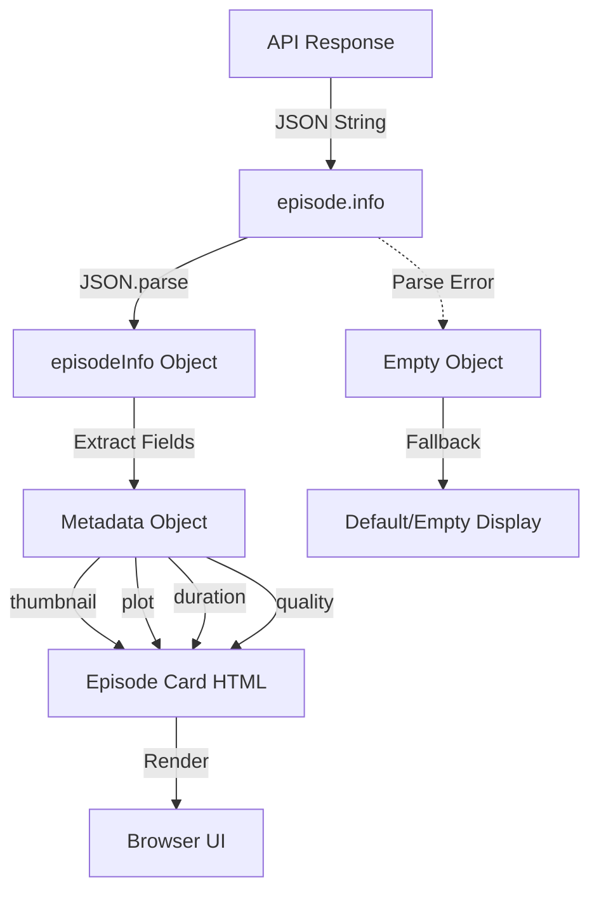

# Episode Metadata Display Issue - Analysis and Fix Plan

## Executive Summary

The episode metadata (images, descriptions, titles, format, quality) is not displaying in the IPTV plugin despite the API returning the data. This document analyzes the root cause and provides a comprehensive fix plan.

## Issue Analysis

### 1. What the Logs Show

From the IINA logs, the API response contains episode data:

```
17:59:01.897 [global - IPTV Player (Enhanced)][d] [IPTV] handleLoadSeriesInfo: Response structure: {
  "hasInfo":true,
  "hasEpisodes":true,
  "episodesType":"object",
  "isEpisodesArray":false,
  "episodeKeys":["1","2","3","4","5"],
  "infoName":"Stranger Things (2016)"
}

17:59:01.897 [global - IPTV Player (Enhanced)][d] [IPTV] handleLoadSeriesInfo: First episode sample: {
  "keys":["id","episode_num","title","container_extension","info","custom_sid","added","season","direct_source"],
  "id":"8803",
  "title":"Stranger Things - S01E01 - Chapitre Un - La disparition de Will Byers",
  "episode_num":1,
  "container_extension":"mkv"
}
```

**Key Observation**: The `info` field is listed in the keys but its VALUE is not shown in the logs. This suggests the `info` field might contain:
- A very long JSON string that got truncated
- Escaped characters causing parsing issues
- Null/undefined value

### 2. Root Cause Analysis

After examining [`browser.js`](browser.js:1146) and [`global.js`](global.js:1522), I've identified the following issues:

#### Issue #1: `episode.info` Field Format

The Xtream API returns `episode.info` as a **JSON-encoded string**, not a JavaScript object. Example:

```json
{
  "id": "8803",
  "title": "Episode Title",
  "container_extension": "mkv",
  "info": "{\"plot\":\"Description...\",\"movie_image\":\"http://...\",\"duration\":\"00:45:00\"}"
}
```

The code at line 1185-1198 in [`browser.js`](browser.js:1185) attempts to parse this:

```javascript
if (episode.info) {
  if (typeof episode.info === 'string') {
    try {
      episodeInfo = JSON.parse(episode.info);
    } catch (e) {
      episodeInfo = {};
    }
  }
}
```

**Problem**: If the `info` string contains:
- Unescaped quotes within values
- Newlines or special characters
- Malformed JSON

The parsing will fail silently and return an empty object.

#### Issue #2: Field Name Mismatches

The current code checks for many possible thumbnail locations (lines 1219-1236):
- `episodeInfo?.stream_icon`
- `episodeInfo?.cover_big`
- `episodeInfo?.movie_image`
- etc.

However, based on typical Xtream API responses, the actual fields in `episode.info` might be:
- `movie_image` (most common for episode stills)
- `plot` (description)
- `duration` (length)
- `rating` (quality/rating)
- `cover` (poster image)

#### Issue #3: HTML Escaping Issues

At lines 1274-1276 in [`browser.js`](browser.js:1274), the code escapes values:

```javascript
const safeStreamId = String(streamId).replace(/'/g, "\\'").replace(/"/g, '&quot;');
```

If `streamId` or other values contain special characters, this could cause the inline onclick handlers to fail.

#### Issue #4: Inline onclick Handler Context

The episodes are rendered with inline onclick handlers (line 1307):

```javascript
onclick="playEpisodeSimple('${safeStreamId}', '${safeExt}', '${safeTitle}')"
```

This approach can fail if:
- The function `playEpisodeSimple` is not in the global scope
- Special characters break the HTML attribute syntax
- The escaping is insufficient

## Proposed Solutions

### Solution 1: Robust `episode.info` Parsing

Add more robust parsing with better error handling and logging:

```javascript
function parseEpisodeInfo(episode) {
  let episodeInfo = null;
  
  if (!episode.info) {
    debug(`Episode ${episode.id}: No info field`);
    return null;
  }
  
  if (typeof episode.info === 'string') {
    try {
      // Clean up common JSON issues
      let cleaned = episode.info
        .replace(/\\"/g, '"')  // Unescape escaped quotes
        .replace(/\\n/g, ' ')   // Replace newlines with spaces
        .replace(/\\t/g, ' ')   // Replace tabs with spaces
        .replace(/\\r/g, '');   // Remove carriage returns
      
      episodeInfo = JSON.parse(cleaned);
      debug(`Episode ${episode.id}: Parsed info successfully`);
    } catch (e) {
      debug(`Episode ${episode.id}: Failed to parse info - ${e.message}`);
      debug(`Raw info: ${episode.info.substring(0, 200)}`);
      episodeInfo = {};
    }
  } else if (typeof episode.info === 'object') {
    episodeInfo = episode.info;
  }
  
  return episodeInfo;
}
```

### Solution 2: Standardized Metadata Extraction

Create a unified function to extract metadata with clear priority:

```javascript
function extractEpisodeMetadata(episode, episodeInfo) {
  // Thumbnail priority order based on Xtream API common fields
  const thumbnail = episodeInfo?.movie_image ||
                   episodeInfo?.cover ||
                   episodeInfo?.poster ||
                   episodeInfo?.thumbnail ||
                   episodeInfo?.backdrop ||
                   episodeInfo?.stream_icon ||
                   episode.cover ||
                   episode.thumbnail ||
                   '';
  
  // Description priority
  const plot = episodeInfo?.plot ||
              episodeInfo?.overview ||
              episodeInfo?.description ||
              episode.plot ||
              episode.overview ||
              '';
  
  // Duration priority
  const duration = episodeInfo?.duration ||
                  episodeInfo?.runtime ||
                  episodeInfo?.length ||
                  episode.duration ||
                  '';
  
  // Quality/Format
  const quality = episodeInfo?.video_quality ||
                 episodeInfo?.quality ||
                 episodeInfo?.rating ||
                 episode.quality ||
                 '';
  
  return { thumbnail, plot, duration, quality };
}
```

### Solution 3: Fix HTML Generation

Replace inline onclick handlers with data attributes and event delegation:

```javascript
// Instead of:
html += `<div onclick="playEpisodeSimple('...')">...</div>`;

// Use:
html += `<div class="episode-card" data-stream-id="${escapeHtml(streamId)}" data-ext="${escapeHtml(ext)}" data-title="${escapeHtml(title)}">...</div>`;

// Then add event listener after insertion:
document.querySelectorAll('.episode-card').forEach(card => {
  card.addEventListener('click', (e) => {
    const streamId = card.getAttribute('data-stream-id');
    const ext = card.getAttribute('data-ext');
    const title = card.getAttribute('data-title');
    playEpisodeSimple(streamId, ext, title);
  });
});
```

### Solution 4: Add Debug Visualization

Add visible debug output directly in the episode cards during development:

```javascript
html += `
  <div class="episode-debug" style="font-size:10px;color:#888;margin-top:5px;">
    ID: ${streamId} | Info: ${episodeInfo ? 'YES' : 'NO'} | Thumb: ${thumbnail ? 'YES' : 'NO'}
  </div>
`;
```

## Implementation Plan

### Phase 1: Enhanced Logging
1. Add detailed logging to show the RAW `episode.info` value before parsing
2. Log the result of parsing (success/failure)
3. Log all extracted metadata fields

### Phase 2: Robust Parsing
1. Implement the `parseEpisodeInfo()` function with error handling
2. Add JSON cleanup for common encoding issues
3. Test with actual API response data

### Phase 3: Fix Rendering
1. Replace inline onclick with data attributes
2. Use event delegation for click handlers
3. Add fallback display when metadata is missing

### Phase 4: CSS Enhancements
1. Ensure `.episode-plot` styles allow text display
2. Verify `.episode-thumbnail` positioning for images
3. Add styles for metadata badges

## Testing Strategy

1. **Unit Test**: Create a test HTML page with mock API responses
2. **Integration Test**: Log actual API responses to verify parsing
3. **Visual Test**: Verify all metadata displays correctly in UI

## Files to Modify

1. [`browser.js`](browser.js:1146) - Main fix location
   - Lines 1177-1339: `renderEpisodesList()` function
   
2. [`styles.css`](styles.css:494) - CSS enhancements
   - Lines 494-678: Episode card styles

3. [`test-episodes.html`](test-episodes.html) - Testing
   - Lines 423-509: Test rendering with various data formats

## Expected Result

After the fix, episodes should display:
- ✅ Thumbnail image (from `episode.info.movie_image` or fallbacks)
- ✅ Episode title (from `episode.title`)
- ✅ Episode description/plot (from `episode.info.plot`)
- ✅ Duration (from `episode.info.duration`)
- ✅ Quality badge (from `episode.info.video_quality`)
- ✅ Container format (from `episode.container_extension`)
- ✅ Episode number badge

## Mermaid Diagram: Data Flow



---

**Next Step**: Switch to Code mode and implement the fixes in `browser.js`.
