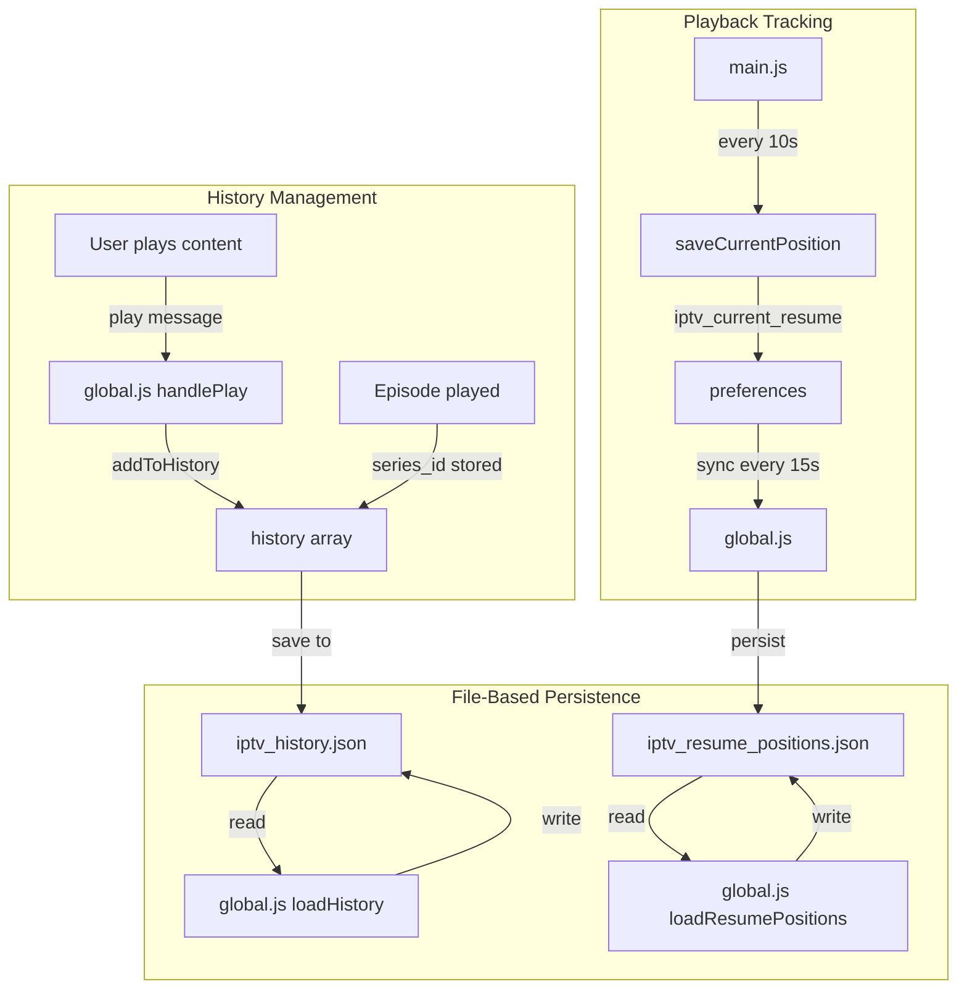

# Plan de Correction - Historique et Reprise de Lecture (v2)

## Résumé des Problèmes Identifiés

### Analyse des Logs
```
19:49:59.062 [IPTV] Loading history: 1 items
19:55:37.806 [IPTV] Loading history: 1 items  ← Même après 6 minutes, toujours 1 item
```

**Problème 1 : L'historique est limité à 1 contenu**
- Le système ne garde qu'un seul élément au lieu d'en accumuler plusieurs
- L'ajout à l'historique écrase l'élément précédent au lieu de l'ajouter

**Problème 2 : L'historique ne persiste pas après fermeture**
- Le stockage utilise `iina.preferences` qui a des limitations
- Pas de sauvegarde dans un fichier comme pour les credentials

**Problème 3 : Les positions de reprise disparaissent**
- Le sync entre main.js et global.js fonctionne mais utilise preferences
- Pas de persistance fichier pour les resume_positions

**Problème 4 : Métadonnées des épisodes non affichées**
- Les images, synopsis, notes ne s'affichent pas correctement
- Problème de parsing du champ `episode.info`

---

## Causes Racines

### 1. Stockage Non Persistant
Dans [`global.js`](global.js:1022-1084), l'historique et les positions utilisent `iina.preferences` :
```javascript
function loadHistory() {
  var d = prefs.get('iptv_history');  // ← Volatile
  // ...
}
function saveHistory() {
  prefs.set('iptv_history', historyJson);  // ← Non persisté en fichier
}
```

**Comparaison** : Les credentials utilisent déjà le système de fichier ( [`writeCredentialsToFile()`](global.js:638-686) ) et persistent correctement.

### 2. Sync Incomplet des Positions
Dans [`global.js`](global.js:121-140), le sync existe mais est limité :
```javascript
setInterval(function() {
  var currentResumeStr = prefs.get('iptv_current_resume');
  if (currentResumeStr) {
    var currentResume = JSON.parse(currentResumeStr);
    state.resumePositions[String(currentResume.streamId)] = {...};
    saveResumePositions();  // ← Sauvegarde dans preferences, pas fichier
  }
}, 15000);
```

### 3. Clé d'Historique Incorrecte pour Épisodes
Dans [`global.js`](global.js:1090-1127), la fonction `addToHistory` utilise :
```javascript
var streamId = item.id || item.stream_id || item.series_id;
state.history = state.history.filter(h => 
  (h.id || h.stream_id || h.series_id) !== streamId
);
```
**Problème** : Pour les épisodes, l'ID change à chaque épisode, donc ils ne remplacent pas l'entrée série précédente.

---

## Architecture de la Solution



---

## Plan d'Implémentation Détaillé

### Phase 1: File-Based Storage for History (CRITICAL)
**Fichier** : [`global.js`](global.js)

1. **Créer les fonctions de fichier** (similaires aux credentials) :
   - `writeHistoryToFile()` - Sauvegarde JSON dans fichier
   - `readHistoryFromFile()` - Lecture JSON depuis fichier
   - `writeResumePositionsToFile()` - Sauvegarde positions
   - `readResumePositionsFromFile()` - Lecture positions

2. **Modifier `loadHistory()`** pour utiliser d'abord le fichier :
   ```javascript
   async function loadHistory() {
     // Tier 1: Try file first
     var fileHistory = await readHistoryFromFile();
     if (fileHistory) {
       state.history = fileHistory;
       return;
     }
     // Fallback to preferences
     // ...
   }
   ```

3. **Modifier `saveHistory()`** pour écrire dans le fichier :
   ```javascript
   async function saveHistory() {
     await writeHistoryToFile(state.history);
     // Also save to preferences as backup
     prefs.set('iptv_history', JSON.stringify(state.history));
   }
   ```

### Phase 2: Améliorer le Sync Resume Positions
**Fichier** : [`global.js`](global.js:121-140)

1. **Augmenter la fréquence** : 15s → 5s pour plus de précision
2. **Ajouter la persistance fichier** dans le sync :
   ```javascript
   setInterval(async function() {
     var currentResumeStr = prefs.get('iptv_current_resume');
     if (currentResumeStr) {
       var currentResume = JSON.parse(currentResumeStr);
       state.resumePositions[String(currentResume.streamId)] = currentResume;
       await saveResumePositions();  // Sauvegarde fichier + preferences
     }
   }, 5000);
   ```

### Phase 3: Corriger la Clé d'Historique
**Fichier** : [`global.js`](global.js:1090-1127)

1. **Distinguer les types de contenu** :
   - Live/VOD : Utiliser `stream_id`
   - Series : Utiliser `series_id` (pas l'ID d'épisode)
   - Episodes : Stocker avec `series_id` pour regroupement

2. **Modification de `addToHistory()`** :
   ```javascript
   function addToHistory(item) {
     // Déterminer la clé unique selon le type
     var uniqueKey = item.series_id || item.stream_id || item.id;
     
     // Supprimer l'ancienne entrée avec la même clé
     state.history = state.history.filter(h => 
       (h.series_id || h.stream_id || h.id) !== uniqueKey
     );
     
     // Ajouter nouvelle entrée
     state.history.unshift({
       ...item,
       playedAt: Date.now()
     });
     
     await saveHistory();
   }
   ```

### Phase 4: Corriger l'Affichage des Métadonnées
**Fichier** : [`browser.js`](browser.js)

1. **Améliorer le parsing de `episode.info`** :
   ```javascript
   function parseEpisodeInfo(episode) {
     if (!episode.info) return null;
     
     if (typeof episode.info === 'string') {
       try {
         // Nettoyer les caractères échappés
         let cleaned = episode.info
           .replace(/\\"/g, '"')
           .replace(/\\n/g, ' ')
           .replace(/\\t/g, ' ');
         return JSON.parse(cleaned);
       } catch (e) {
         console.error('Failed to parse episode info:', e);
         return null;
       }
     }
     return episode.info;
   }
   ```

2. **Vérifier les champs d'extraction** :
   - Thumbnail : `movie_image`, `cover`, `poster`, `backdrop`
   - Plot : `plot`, `overview`, `description`
   - Duration : `duration`, `runtime`
   - Rating : `rating`, `vote_average`

### Phase 5: Gestion des Erreurs
**Tous les fichiers**

1. **Try-catch sur toutes les opérations fichier**
2. **Fallback vers preferences si fichier échoue**
3. **Logs détaillés pour debug**

---

## Fichiers à Modifier

| Fichier | Lignes | Modifications |
|---------|--------|---------------|
| [`global.js`](global.js) | 1022-1127 | File-based history storage, improved sync |
| [`main.js`](main.js) | 155-186 | Vérifier le saveCurrentPosition |
| [`browser.js`](browser.js) | 1315-1362 | Parsing episode.info |
| [`Info.json`](Info.json) | - | Bump version to 6.2.0 |

---

## Tests de Vérification

1. **Test Persistance** :
   - Jouer 3 contenus différents
   - Fermer IINA
   - Rouvrir IINA
   - Vérifier que l'historique montre 3 items

2. **Test Reprise** :
   - Jouer un VOD, arrêter à 50%
   - Fermer IINA
   - Rouvrir, recliquer sur le même VOD
   - Vérifier la proposition de reprise

3. **Test Épisodes** :
   - Jouer un épisode de série
   - Vérifier que l'image/synopsis s'affiche
   - Vérifier que l'historique regroupe par série

---

## Estimation

- **Complexité** : Moyenne
- **Fichiers modifiés** : 3
- **Lignes ajoutées** : ~150-200
- **Temps estimé** : 2-3 heures de développement + tests

---

## Prochaine Étape

**Switch to Code mode** pour implémenter les corrections une fois ce plan approuvé.
