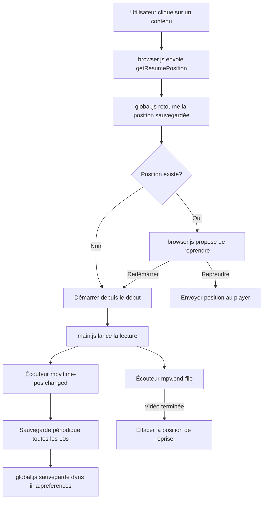

# Plan d'Implémentation - Historique et Reprise de Lecture

## Analyse des Problèmes Identifiés

### 1. Erreur btoa/atob (CRITIQUE)
**Localisation** : [`global.js`](global.js:486-509)
**Problème** : L'environnement JavaScript d'IINA ne dispose pas des fonctions standard `btoa()` et `atob()` pour l'encodage Base64.
**Impact** : Les mots de passe ne peuvent pas être encodés/décodés, ce qui perturbe le stockage des credentials.

**Logs** :
```
[global - IPTV Player (Enhanced)][e] [IPTV] ERROR: [Storage] Failed to encode password: Can't find variable: btoa
```

### 2. Suivi de Progression de Lecture Non Implémenté
**Localisation** : [`main.js`](main.js:1-95)
**Problème** : Aucun mécanisme n'existe pour surveiller la position de lecture (`time-pos`) et la sauvegarder périodiquement.
**Impact** : Les positions de reprise ne sont jamais mises à jour après le lancement de la lecture.

### 3. Historique Non Persisté Correctement
**Localisation** : [`global.js`](global.js:911-939)
**Problème** : Bien que le code existe pour charger/sauvegarder l'historique, les clés de stockage peuvent être incorrectes ou la sérialisation JSON échoue silencieusement.
**Impact** : L'historique disparaît après redémarrage d'IINA.

**Logs** :
```
[global - IPTV Player (Enhanced)][d] [IPTV] [Storage] No history found in storage
[global - IPTV Player (Enhanced)][w] Trying to get preference value for undefined key iptv_resume_positions
```

### 4. Interface de Reprise Non Connectée
**Localisation** : [`browser.js`](browser.js:1898-1917)
**Problème** : Le handler de position de reprise existe mais n'est pas complètement intégré au flux de lecture.
**Impact** : L'utilisateur n'est jamais invité à reprendre là où il s'était arrêté.

## Architecture de la Solution



## Détails des Modifications Requises

### 1. Fonctions Base64 Custom (global.js)
Remplacer `btoa()`/`atob()` par des implémentations pures JavaScript compatibles IINA.

### 2. Tracking Playback (main.js)
Ajouter des écouteurs d'événements mpv :
```javascript
// Surveiller la position toutes les 10 secondes
iina.event.on("mpv.time-pos.changed", (position) => {
  // Sauvegarder la position
});

// Détecter la fin de lecture
iina.event.on("mpv.end-file", () => {
  // Effacer la position ou marquer comme vu
});
```

### 3. Amélioration du Stockage (global.js)
- Vérifier les clés de stockage : `iptv_history`, `iptv_resume_positions`
- Ajouter des logs de debug détaillés
- Gérer les erreurs de parsing JSON

### 4. UI Reprise (browser.js + browser.html)
- Ajouter une section "Continuer à regarder"
- Afficher une boîte de dialogue de confirmation avec le pourcentage visionné
- Permettre le choix entre reprise et redémarrage

### 5. Communication Inter-Fichiers
Utiliser `iina.preferences` comme canal de communication entre main.js et global.js pour les mises à jour de position.

## Fichiers à Modifier

| Fichier | Modifications |
|---------|--------------|
| [`global.js`](global.js) | Fonctions Base64 custom, amélioration du stockage historique/positions |
| [`main.js`](main.js) | Ajout des écouteurs mpv pour tracking position |
| [`browser.js`](browser.js) | Intégration complète de la reprise, UI "Continuer à regarder" |
| [`browser.html`](browser.html) | Section "Continuer à regarder", styles pour la boîte de reprise |
| [`Info.json`](Info.json) | Mise à jour de la version et description |

## Vérification des APIs IINA

D'après la documentation IINA, les APIs suivantes sont utilisées correctement :
- ✅ `iina.preferences.get/set` - Stockage clé-valeur
- ✅ `iina.event.on("mpv.*")` - Événements mpv
- ✅ `iina.mpv.getNumber("time-pos")` - Récupération position
- ✅ `iina.core.open()` - Ouverture URL
- ✅ `iina.standaloneWindow.postMessage` - Communication UI

## Tests Recommandés

1. **Test Base64** : Encoder/décoder un mot de passe avec caractères spéciaux
2. **Test Historique** : Visionner un contenu, redémarrer IINA, vérifier l'historique
3. **Test Reprise** : Arrêter à 50%, redémarrer, vérifier la proposition de reprise
4. **Test Fin** : Visionner jusqu'au bout, vérifier que la position est effacée
5. **Test Multi-contenu** : Vérifier que chaque contenu a sa propre position

## Estimation

Cette implémentation nécessite :
1. Modifications dans 4 fichiers principaux
2. Ajout de ~200-300 lignes de code
3. Création d'un nouveau fichier pour les utilitaires Base64 (optionnel)
4. Tests end-to-end complets

---

**Prêt pour implémentation** : Une fois ce plan approuvé, je peux passer en mode Code pour implémenter toutes les corrections.