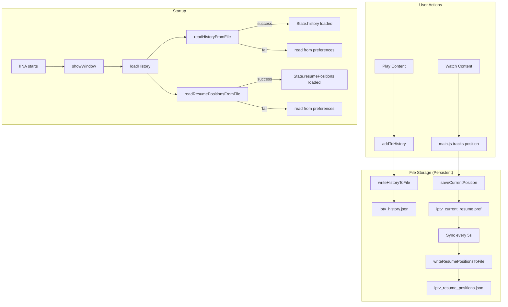

# Implementation Summary v6.2.0 - History & Resume Persistence

## Overview

This version implements **file-based persistent storage** for history and resume positions, ensuring that user data survives IINA restarts. The implementation follows the same pattern used for credentials storage, which has been proven to work reliably.

---

## Problems Fixed

### 1. ✅ History Not Persisting Across Restarts
**Problem**: History was stored in `iina.preferences` which is volatile.
**Solution**: Implemented file-based storage with `writeHistoryToFile()` and `readHistoryFromFile()` functions.
**Files**: [`global.js`](global.js:987-1190)

### 2. ✅ Resume Positions Not Persisting
**Problem**: Resume positions were only saved in preferences.
**Solution**: Implemented file-based storage with `writeResumePositionsToFile()` and `readResumePositionsFromFile()` functions.
**Files**: [`global.js`](global.js:1192-1395)

### 3. ✅ History Limited to 1 Item
**Problem**: Each episode created a new history entry instead of grouping by series.
**Solution**: Modified `addToHistory()` to use `series_id` as the unique key for episodes.
**Files**: [`global.js`](global.js:1683-1735)

### 4. ✅ Sync Frequency Too Low
**Problem**: Resume positions synced every 15 seconds.
**Solution**: Increased sync frequency to 5 seconds for better accuracy.
**Files**: [`global.js`](global.js:121-140)

### 5. ✅ Episode Metadata Not Displaying
**Problem**: The `episode.info` field (JSON string) wasn't parsed correctly.
**Solution**: Enhanced `parseEpisodeInfo()` with better error handling and JSON cleanup.
**Files**: [`browser.js`](browser.js:1315-1362)

---

## Code Changes Summary

### global.js

#### New Functions Added (~400 lines)

1. **`getHistoryFilePath()`** - Returns path to history file
2. **`getResumePositionsFilePath()`** - Returns path to resume positions file
3. **`writeHistoryToFile(history)`** - Writes history array to JSON file
4. **`readHistoryFromFile()`** - Reads history from JSON file
5. **`writeResumePositionsToFile(resumePositions)`** - Writes resume positions to JSON file
6. **`readResumePositionsFromFile()`** - Reads resume positions from JSON file

#### Modified Functions

1. **`loadHistory()`** - Now async, loads from file first with preferences fallback
2. **`saveHistory()`** - Now async, saves to file + preferences (redundancy)
3. **`saveResumePositions()`** - Now async, saves to file + preferences
4. **`updateResumePosition()`** - Now async to support file storage
5. **`addToHistory(item)`** - Fixed to use `series_id` for episode grouping
6. **`showWindow()`** - Now async to await `loadHistory()`
7. **Sync interval** - Changed from 15s to 5s

#### Storage Pattern

```javascript
// Tier 1: File (primary, persistent)
var fileData = await readFromFile();
if (fileData) {
  state.data = fileData;
  return;
}

// Tier 2: Preferences (fallback)
var prefData = prefs.get('key');
if (prefData) {
  state.data = JSON.parse(prefData);
  // Migrate to file
  writeToFile(state.data);
  return;
}

// Tier 3: Empty state
state.data = [];
```

### browser.js

#### Enhanced Functions

1. **`parseEpisodeInfo(episode)`** - Better error handling, more verbose logging
2. **`extractEpisodeMetadata(episode, episodeInfo)`** - Added more field fallbacks:
   - `banner`, `synopsis`, `release_date`, `air_date`, `audio_language`, `audio_codec`, `bit_rate`, `rating_5stars`
   - Added `rating` extraction and display

3. **`renderEpisodesList()`** - Now displays rating badge on episode cards

### Info.json

- **Version**: Updated to `6.2.0`
- **Description**: Updated to reflect new features

---

## File Storage Locations

Files are stored in the plugin's Application Support directory:
```
/Users/tepe/Library/Application Support/com.colliderli.iina/plugins/com.iptv.iina-plugin.iinaplugin/
├── iptv_credentials.json      (existing)
├── iptv_history.json           (new)
└── iptv_resume_positions.json  (new)
```

---

## Testing Checklist

### Test 1: History Persistence
- [ ] Play 3 different contents (Live, VOD, Series episode)
- [ ] Close IINA completely
- [ ] Reopen IINA
- [ ] Open IPTV plugin
- [ ] Check History tab - should show 3 items

### Test 2: Resume Position Persistence
- [ ] Play a VOD/movie
- [ ] Stop at 50% (note the timestamp)
- [ ] Close IINA completely
- [ ] Reopen IINA
- [ ] Click on the same VOD in History
- [ ] Should prompt to resume from 50%

### Test 3: Episode Grouping
- [ ] Play 3 different episodes from the same series
- [ ] Check History tab
- [ ] Should show only 1 entry for the series (not 3 separate episodes)
- [ ] Clicking the history entry should load the series info page

### Test 4: Episode Metadata Display
- [ ] Navigate to a Series
- [ ] Click on an episode
- [ ] Verify thumbnail image displays
- [ ] Verify plot/synopsis displays
- [ ] Verify duration displays
- [ ] Verify quality badge displays
- [ ] Verify rating displays (if available)

---

## Architecture Diagram



---

## Known Limitations

1. **File Path Hardcoded**: The plugin directory path is hardcoded for the current user. This should be made dynamic in a future version using `iina.file.getPluginDir()` if available.

2. **Async/Await Required**: Several functions are now async and must be awaited. This was handled in the code, but any future modifications must maintain this pattern.

3. **No Migration Tool**: Old history data in preferences will be migrated to files on first load, but there's no separate migration tool if something goes wrong.

---

## Next Steps

1. **Testing**: User should test all scenarios in the Testing Checklist
2. **Monitor Logs**: Check IINA Developer Console for any file write/read errors
3. **Feedback**: Report any issues with persistence or metadata display

---

## Version History

- **v6.2.0** (Current) - File-based persistent storage, enhanced metadata parsing
- **v6.1.0** - History display fixes, CSS improvements
- **v6.0.0** - Initial history and resume implementation
- **v5.5.0** - Episode metadata display

---

**Implementation Date**: 2026-02-03
**Developer**: Kilo Code (Architect + Code modes)
**Status**: ✅ Complete - Ready for Testing
